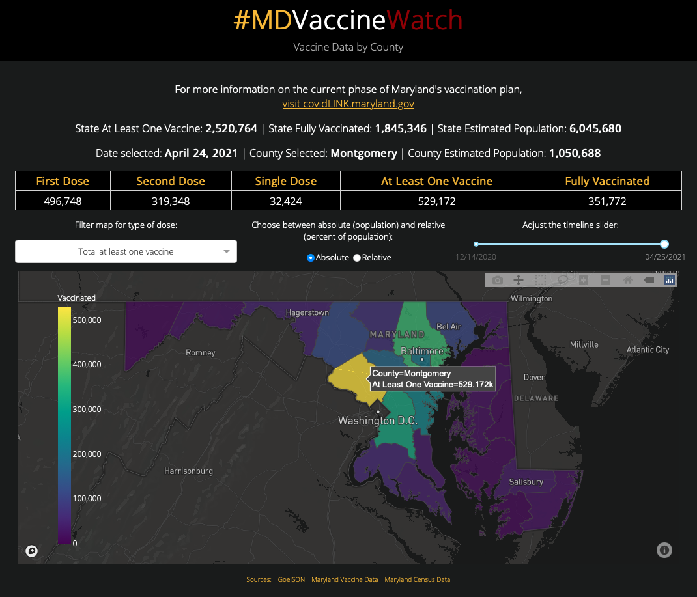
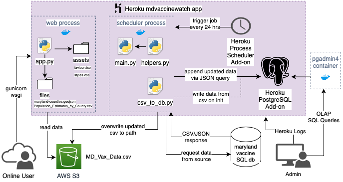

Thorughout the COVID-19 pandemic, data has played a integral role in keeping people informed. There is an immense amount of open data that's free to use relating to the pandemic, making it a perfect subject for a data-driven web app.

In this article, I go over my process of creating a dashboard application from scratch:
1. Creating the app with [Plotly Dash](https://dash.plotly.com)
2. Creating a data pipeline to automatically update my app's data
3. Container-izing everything with [Docker](https://docs.docker.com)
4. Deploying the app on [Heroku](https://devcenter.heroku.com)

[https://mdvaccinewatch.herokuapp.com](https://mdvaccinewatch.herokuapp.com)

# Overview
I got the idea for this project while following along with a [Real Python tutorial on Dash](https://realpython.com/python-dash/). After completing the tutorial and reading thorugh some of Dash and Plotly's documentation, I wanted to simply try mapping a vaccine data from a CSV file ([maryland.gov](maryland.gov)) to county positions on a map. I chose my home state of maryland becuase it is:

- Relevent
- The data is easily accessable
- The size of the data is relatively small

# Getting things working locally

### Dash
After reading through some of the [Plotly/Dash documentation](https://dash.plotly.com), I created html with the Dash API using their html components library and mapped my data to each county location using GEOJSON data. I then created the interfacing tools used to manipulate and filter the data using callback functions.

### Data pipeline
At this point, I was just reading the data from a static CSV file. The ultimate goal would be to update the data automatically every day. I did this by creating a script that attempts to retrieve the statically-hosted csv file and download it to a local path. Ideally, I would establish a connection to the database that hosts the information and send SQL queries to regularly update it, but that service (ArcGIS) is proprietary, so I'm limited to downloading the entire CSV.

Once I created a seperate script for the job, I found a sceduler to automate the job for me. I picked the Python module [schedule](https://schedule.readthedocs.io/en/stable/) by Dan Bader to run the update data job because it's very simple to use and does't require any external dependencies. There are microservices that could do this, but I wanted to stay PaaS-agnostic at his point because I was still considering the pros and cons of each.

### Docker
Once the sceduler was working, I decided it was a good idea to containerize everything with Docker to make it (hopefully) easier to deply. Following the rule of "containers should do one thing", I created two pyhton:3.8 containers:

1. The Dash app itself
2. The recurring data ingestion job

I configured the containers each with their own seperate Dockerfiles and requirements.txt files. The data from the scheduler container is persisted in a volume that it shares over a network connection with the app container. Docker Compose orchestrates the execution of the Dockerfiles, managing the creation of the containers and making sure that the images are built in the necessary order.

### Deployment with Heroku
Okay, so things were looking good development-wise. I was thinking about deploying my application to share it with the world. Heroku is *free*, so I had decided to use their service to host my site. It should be as easy as pushing my containers up to cloud and running them, just like I had done locally, *right?* **Wrong!**
After some research (and frustration), I realized:

**In Heroku, filesystems are *ephemeral:*** meaning that mounting volumes would not be possible.

Since Heroku spins down your app after an hour of inactivity, the filesystems also disappear. Additionally, the scheduled loop would be forced to close and would not be able to call the data ingestion function because the app would not be running.

### Rethinking the data pipeline
I needed to rethink the architecture of my app. Not only was the current local implementation impossible with a free Heroku plan, it was inefficient.

Instead of using volumes to persist data, I chose to store my dynamically updated data in the cloud. The data would also be uploaded via external trigger, rather than an endless loop that isn't able to turn itself back on if it goes down.

I redesigned the scheduler process to include a handful of functions that retrieve the data via HTTP requests and JSON queries, storing the data collected in an AWS S3 bucket and PostgreSQL Database. Once the CSV data is transformed and uploaded to the S3 bucket, it can be retrieved to use with the Dash app for OLTP (*Online Transactional Processing*). The data stored in the PostgreSQL Database can be used for archival and anaylsis, OLAP (*Online Analytical Processing*). The functions are called in main.py, the entrypoint for the scheduler process.

*Creating an entity relation diagram to helped to visualize the system architecture.*

As I looked for an external tigger that I could schedule for my recurring job execution, I found [Heroku Scheduler](https://devcenter.heroku.com/articles/scheduler) add-on, but realized that it has its own limitations: You can only schedule task in the web process when using Docker containers. However, I found another Heroku add-on, the [Process Scheduler](https://devcenter.heroku.com/articles/process-scheduler), that allows for execution of any process, just what I needed!

Again though, there was a caveat: the Process Scheduler is designed to trigger and run jobs that stay up until it forces them to shut back down. If your program finishes and exits, the process scheduler will think it has crashed and try to reboot it, which may cause problems. Luckily, I was able to get around this by designing the `main` function of main.py to be called once when the program is executed, and then sleep continuously until the add-on shuts it down. This spends more dino hours, but seeing as the job is once a day and only averages 0.4 dino-hours, I managed to keep things free.

While implementing these changes, I decided to use a [heroku.yml](https://devcenter.heroku.com/articles/build-docker-images-heroku-yml) file to build my containers (as opposed to the docker-compose.yml I used for local development) to allow Heroku to build my images for me to offest some of the processing, and minimize container uploads. Along with other features, it has the advantage of being able to define add-ons on creation.

I used [direnv](https://direnv.net), a useful shell tool for managing virtual environments and environment variable, to help with reproducability when working with Heroku and Docker.

# Furthermore
No doubt, the implemetaion of this webapp is far from perfect. There are still many imporvements that can be made, and features that could be added. For example, if I expected to see more traffic on the site but wanted things to be cost effective, I could redesign tha app with a [serverless architecture model using AWS lambda funtions](https://www.serverless.com/flask). This could be an efficient way to implement the app (depending on the amount of traffic) because of how you are only charged per-request.

Additionally, the functionality of this app should be well tested. One of my next goals is to write unit and integration tests for this project using the [Pytest framework](https://docs.pytest.org/en/6.2.x/). That will help to improve the [CICD (Continuous Integration Continous Development) pipeline](https://realpython.com/python-continuous-integration/), keeping things from breaking things when making impovements and adding features to the site.

The process of designing, implemeting, and deploying this app didn't go the smoothest-- and I think that's exactly what I needed in order to get my feet wet. If I never tried to *just make it work* and (inevitably breaking things), I wouldn't have learned nearly as much as I did. Following tutorials is great way to get introduced to something, but it can be easy to get lost in the sauce and come out feeling short of direction. For a while, I felt like I was stuck in *tutorial hell* and would be discouraged when I didn't have much to show for all of the work that I put in.

I encourage anyone who feels like that to just start working on something. Pick anything! *It's okay to re-invent the wheel if you learn something from it.* If you'd like to fork [this repository on Github](https://github.com/dennisgsmith/MDVaccineWatch) and make changes to it feel free to! Change it, break it, fix it, and ultimately learn from the process.

## Credits
The GeoJSON mask of Maryland counties is provided courtesy of @frankrowe (https://github.com/frankrowe/maryland-geojson/blob/master/maryland-counties.geojson).

Vaccination data is provided by Maryland State Gov. (https://data.imap.maryland.gov/)

Total population by county is provided by the U.S. Census Beurau (https://www.census.gov/).